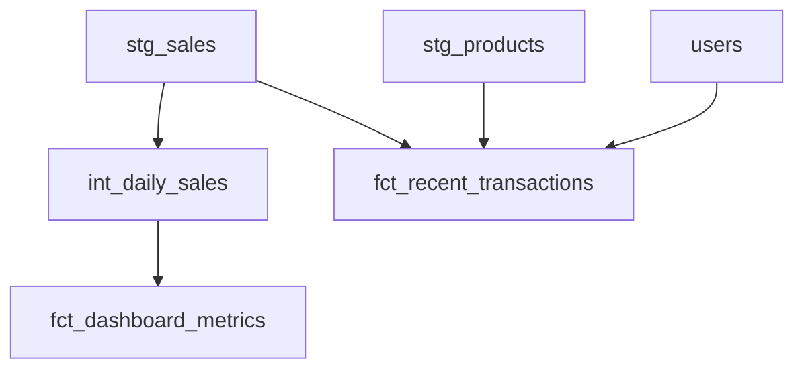

# Mart Layer Documentation

## Core Marts

### fct_dashboard_metrics
Real-time dashboard metrics with growth calculations.

**Key Metrics:**
- Daily sales totals
- Customer counts
- Day-over-day growth percentages

**Business Rules:**
- Growth calculations use NULLIF to handle division by zero
- Metrics are filtered to last 24 hours
- All amounts include tax

**Example Usage:**
```sql
SELECT 
    metric_date,
    total_sales,
    sales_growth_pct
FROM {{ ref('fct_dashboard_metrics') }}
WHERE metric_date = CURRENT_DATE()
```

### fct_recent_transactions
Last 24 hours of transaction details.

**Key Features:**
- JSON aggregation of order items
- Customer details from users table
- Product information
- Transaction timestamps

**JSON Structure:**
```json
{
    "product_name": "Item Name",
    "quantity": 2,
    "total": 25.99
}
```

## Schema Design

### Fact Tables
- Focus on measurable metrics (sales, orders, visitors)
- Include foreign keys to dimensions
- Maintain grain at transaction level where needed

### Dimension Tables
- Branch information
- Product details
- Customer segments
- Date dimensions

## Testing Strategy

### Data Quality Tests
```yaml
models:
  - name: fct_dashboard_metrics
    columns:
      - name: total_sales
        tests:
          - not_null
          - positive_value
      - name: sales_growth_pct
        tests:
          - between:
              min_value: -100
              max_value: 1000
```

## Refresh Schedule
- Staging: Hourly
- Intermediate: Hourly
- Marts: Hourly with some daily aggregations

## Dependencies
